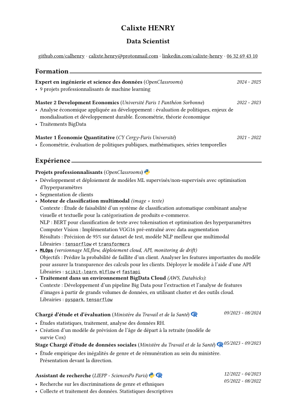
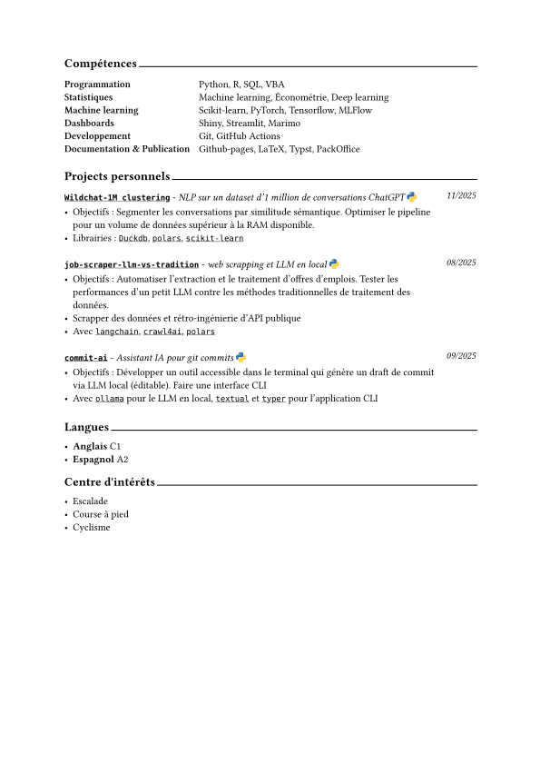

# **Curriculum Vitae**

This is my CV made with [Typst](https://typst.app/home/)





--- 

## **Modules**

The CV script can be customized by modules (.typ files).  
I currently use 2:
- **personal-info.typ** is a secrets file
- **custom-content.typ** contains variables, imported to the main file to customized the cv to the job offer.

### **personal-info.typ**
Used to hide my personal contact info and for you to have a better experience if you clone this repo and want to add your own informations, just copy and update the code below.  
The files contains typst dictionnaries, below a brief example of this file:

```typst
#let real = (
  name: "Jhon Doe",
  email: "jhon.doe@mail.com"
  
#let anom = (
    name: "name",
    name_lower: "name_lower",
```

Then import the content to the main file: *I comment/ uncomment to select the content i want*
```typst
#import "modules/personal-info.typ": real as personal-info
//#import "modules/personal-info.typ": anom as personal-info
```

### **custom_content.typ**

Contains elements to be inserted in the main content (mainly in the skills section), this allows to fit better the job offer and improve the [ATS](https://www.coursera.org/articles/applicant-tracking-system) score.  
```typst
#import "modules/custom_content.typ": python_libs, var2
... 
//Then reference the variables in the document:
// Include it inside already present content)
[Python #python_libs, R, SQL, VBA],
// add whole element (whole line)
..cloud_skills,
// add content at the end of a line
[Scikit-learn, PyTorch] + ", " + ml_models,
```
*Look at the main file to see the full picture.*


### Folder structure:
```shell
.
├── cv_datascientist.typ  # main file
├── images
│   ├── page1.svg
│   └── page2.svg
└── modules
    ├── custom_content.typ
    └── personal-info.typ
```
